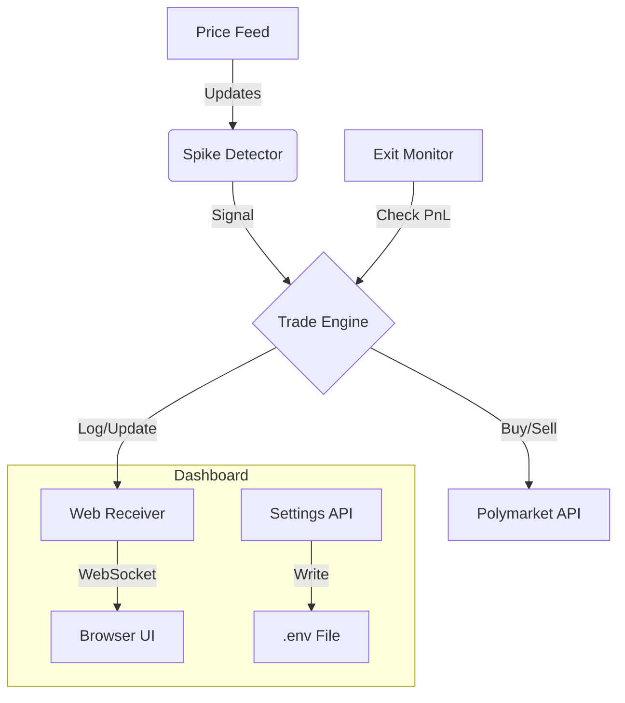

# PolySpike Trader

A real-time trading bot for Polymarket that detects price spikes and executes trades automatically.

## Features

- 📈 **Spike Detection** - Monitors price movements and detects rapid changes
- ⚡ **Automatic Trading** - Places buy/sell orders based on spike direction
- 🎯 **Take Profit / Stop Loss** - Configurable exit conditions
- 📊 **Real-time Dashboard** - Monitor trades, positions, and logs via web UI
- ⚙️ **Easy Configuration** - Configure wallet and settings directly in the dashboard
- 🐳 **Docker Ready** - Simple one-command deployment
- 🔒 **Secure** - Private keys are handled securely and never exposed in logs

## Installation & Setup

### 1. Install Prerequisites

**Docker Desktop** (Required)
1. Download from [Docker's official site](https://www.docker.com/products/docker-desktop/).
2. Run the installer and follow the on-screen instructions.
3. **Important**: After installing, open **Docker Desktop** app and let it start up. You should see a green status indicator in the app.

**Git** (Recommended)
1. Download from [git-scm.com](https://git-scm.com/downloads).
2. Install with default settings.

### 2. Download the Bot
Open your terminal (Command Prompt, PowerShell, or Terminal) and run:

```bash
git clone https://github.com/GLVictoria/Polymarket-spike-bot-v1.git
cd Polymarket-spike-bot-v1
```

*(Alternatively, download the ZIP file from GitHub, extract it, and open a terminal in that folder)*

### 3. Start the Bot
In your terminal, inside the project folder, run:

```bash
docker-compose up -d
```
*This will download necessary files and start the bot in the background.*

### 4. Configure via Dashboard
Once the bot is running:
1. Open your browser to **http://localhost:5000/settings**
2. Enter your **Private Key**, **Proxy Wallet**, and **Trader Address**
3. Click **Save Settings**

The bot is now active and trading! 🚀

### 3. Monitor
Go to **http://localhost:5000** to see:
- Bot status & uptime
- Active trades with live PnL
- Position overview
- Price monitor
- Trade history
- Live streaming logs

---

## Manual Installation (Python)

If you prefer to run without Docker:

1. **Install Dependencies**
   ```bash
   pip install -r requirements.txt
   ```

2. **Run the Bot**
   ```bash
   python main.py
   ```

3. **Configure**
   - Open **http://localhost:5000/settings** to configure the bot.
   - Or manually copy `example.env` to `.env` and edit it.

## Configuration

You can configure these settings via the Dashboard or `.env` file:

| Setting | Description | Default |
|---------|-------------|---------|
| `trade_unit` | Trade size in USDC | 3 |
| `slippage_tolerance` | Max slippage allowed | 0.06 (6%) |
| `spike_threshold` | Price change to trigger trade | 0.01 (1%) |
| `pct_profit` | Take profit percentage | 0.03 (3%) |
| `pct_loss` | Stop loss percentage | -0.025 (-2.5%) |
| `holding_time_limit` | Max time to hold a position | 60s |
| `cooldown_period` | Wait time between trades | 120s |

## dashboard

The dashboard runs on port `5000` by default.

- **Home**: http://localhost:5000
- **Settings**: http://localhost:5000/settings
- **API**: http://localhost:5000/api/status

## Architecture



## Troubleshooting

- **Bot not trading?** Check the "Live Logs" on the dashboard for errors.
- **Dashboard 500 Error?** Ensure the `.env` file is writable or create it via the Settings page.
- **Docker issues?** Run `docker-compose logs -f` to see container output.

## License

MIT
